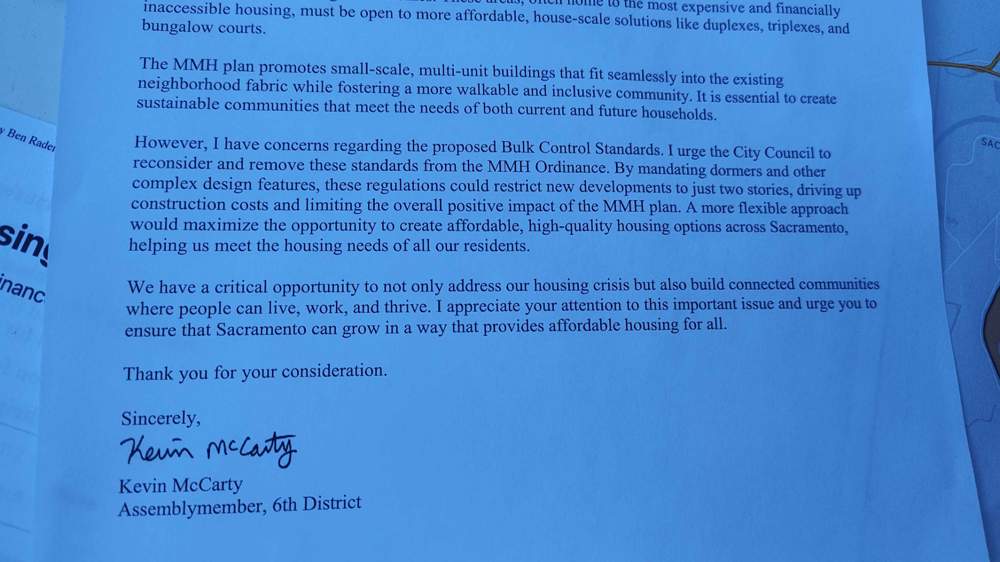

City Council Meeting 4/14/2026
Topics: Missing Middle, Title 17, SB 79, 2040 General Plan
Written By Alyssa Lee

# Public comments
### Chris Valencia, North State Building Industry Association
- keep the original MMH ordinance without the bulk control standards
- vague and inconsistent enforcement of design standards add time and cost
***
### Rep from Sacramento Association of Realtors
- adding more lengthy design standards is a problem
- increasing supply is a key part of addressing affordability
- need projects to be able to move forward
***
### @Troy W. | Capitol Park Area
- great to focus on missing middle housing
- oppose bulk controls
- clear to Sacramentans that we have issues with housing availability
- thank you for how prohousing city has been
 ***
### @Ryan | New-ton Booth!
- don't think pitched roofs necessarily make for beautiful housing
- think flat roofs are great looking in our city
- want to get away from fixating on shape of building
- don't see many buildings that have 3rd floor building into a gabled roof. Don't want to make it infeasible.
***
### @Michael Bevens
- whatever is passed, it should be simple and understandable to the layman. I wanna know clearly what I can or can't build.
- Strong Towns adage: no neighborhood should be exempt from  incremental change and no neighborhood should be - - ---- subject to radical change
***
### Michael Sturgeon, House Sac
- listed all groups who've written in to support MMH without bulk control standards, incl. ECOS and East Sac Community - -- Association, this year and 2 years ago in 2024 when interim MMH ordinance was first coming to council
- quoted part of then Assemblymember Kevin McCarty's letter (attached)

***
### @Damien D
- oppose width/depth restriction and max. eave height
- Sac already allows more housing than other cities through progressive zoning but design restrictions can still block those - housing types in practice
- Haley, rep from Sac Chamber of Commerce
- new standards risk undermining zoning progress
- mentioned how limited housing affects sac's workforce
***
### @Alyssa Lee | New Era Park (me!)
- emphasized that the new width/depth reqs and 24' eave cap would apply to 80% of city (FAR 1.0 areas) - this would be significant
- bulk control is at its core an asesthetic preference that believes 3-story buildings aren't as valid as single-family homes
- anecdote: just attended a house party in the backyard of a 6-plex that was held by my friends and their neighbors in that same building.
- apartments, triplexes, 6plexes are just as valid housing as single family homes. They're housing that people in our community already live in.
 ***
### @Troy | New Era Park
- understand the sense from Optocos that they need to disguise MMH as single family homes, but think we can cut to the chase in Sac
- liability time bomb - need to build more housing in the built up areas of city
- sorry I missed a bunch of what you said!
***
### @Kurt | Midtown
- new restrictions are aesthetic in nature
- sorry I missed a bunch of this too!
***
### Jenessa
- have been a teacher, want to become a very small developer. Have dreamed about building a 6Plex or 8Plex and living in a unit and renting the rest out for very low income renters.
- attended the Small Scale Developer incubator workshop
started looking for lots
- once I started looking into it, I could not even build 3 stories. Bulk control standards made for very awkward floor plans where people could not stand up fully.
***
### Varun Arora
- think staff have misinterpreted Opticos' directions
- don't see any 100-ft-wide buildings that there is a fear of
- want all neighborhoods to have density and walkability and economic opportunity. Let district 3 have DOCO, full taco plazas, etc!
 ***
### Conner Finney, House Sac
- proposed amendments miss the mark, represents a downzoning from the interim ordinance
- comes down to housing we can afford
***
### some dude named Nate
- want to retain bulk control standards
- as we increase density, we must add parks
***
### Dov Kadin, Vice Chair of Planning & Design Commission
- we've been at the MMH ordinance for a few years. Body took a courageous step to allow for more affordable housing types across the city
- Concern from some public was that it would lead to huge transformation of neighborhoods.
as we hammered out design details, council decided to leave bulk control standards in the interim housing ordinance to see how it would play out.
- No other city leading on MMH has bulk control - this is unique to Sac.
Since then, we haven't seen a single project between 3-8 units.
- That was the whole point of the interim ordinance.
- We need to think fo making it more flexible, not less. Make it a simple-to-undeestand code. No bulk control, no pitched roof requirements, no width/depth requirements.
***
# Council comments
### District 5 - Caity Maple:
Is it true that bulk control is being removed?

**Jenn Moseley**: 
- Yes, for FAR 2.0. For FAR 1.0, bulk control removed and replaced with max 24' eave height.

**Maple**: 
- What's the rationale for changing those design standards?

**Jenn Moseley**:
- want to increase intensity near transit

**Maple**:
- it seems like we are removing bulk control but creating a different requirement that is similar, with the 3rd story and width/depth requirements.

**Tony from Opticos**:
- pitched roof isn't a requirement, only if you want to build a 3rd story.

**Maple**: 
- overall sentiment I've heard is we're trying to increase density in neighborhoods that are dominated by single family homes.
- People are priced out.
- What if we could add density in a way that's more gentle?
- We want to make it as easy as possible so that slowly over time, we can see these new housing types come in. Concerned with adding those requirements. I hear from people how hard it is to build.
- Where does the recommendation for raising height limit to 4-5 stories in the FAR 2.0 areas come from?

**Tony from Opticos**: 
- missed his answer
 
**Maple**: 
- Is this a problem we are seeing that we need to add restrictions for? 

**Tom Pace**:
- No. I think building code is the main limitation, not the zoning. Building code for 1-2-unit dwellings is easier to comply with (falls under CA residential building code) than for 3+ unit (falls under CA business building code).

**Maple**: 
- what I've heard most while in office is a deep concern about the ability to find and keep housing people can afford.
- Especially for young people and seniors.
- I remain concerned about adding additional barriers at all to adding housing and  density esp when it just comes down to aesthetics of fitting into the houses that are already there.
- don't want to be back here again in a couple years to change the zoning code again. Want us to be a bit more bold now.
- what I've heard on dais over and over is that people want density.
- want to direct staff to keep inteirm ordinance as is and remov bulk controls

- would love to be receiving a mountain of applications.
- If things are running rampant and issues arrive, than we can readdress.
- Worried about adding restrictions at the outset.

**Tom Pace**
- 3-story building with a flat roof would not be approved ministerially but could go through addtl review process
***
### District 1 - Lisa Kaplan
- agree with Maple
- want to see diversity of housing types

**Opticos**: 
- Our reason for these recommendations is because of neighborhood dissent. In our experience, neighbors resist and push back. [basically saying neighbors push back against 3-story flat roof buildings or larger buildings on lots.] But if council is willing to set the policy as such, we have created standards for that.

**Kaplan**
- Seems like people don't always take issues with 3 stories because I see 3-story single family homes. But think it's about 3-story next to single-story. Need to remember that young people deserve to have homes and sentiments of older established people worried about their property values can be dismissive of that.

- Want to make our 3plexes and 4plexes affordable and want to see them in our suburbs.

- referenced @Michael Bevens | D2 's comment that whatever we make, want it to be bullet point simple and understandable.
want to see changing state law to allow single-stair walkups above 3 stories (Lisa is clearly watching About Here!)

- How is discretionary review for MMH streamlining from what we have now? 

**Greg Sandlund**:
- honestly didn't get his response lol sorry

**Kaplan**:
- also mentioned she had personal experience having a much taller building than the other houses around it come up in her neighborhood that she did think was a problem that staff should prevent 😶
 ***
### District 6 - Eric Guerra
- bulk control was the most controversial part of ordinance
- "trust but verify" - we said we'd come back in a year if it was a hindrance
- heard lots of concerns from neighbors - solar panels, urban backyard gardens/urban ag, etc.
- encourage you to sit down again and make this policy more clearly interpretable
- thank House Sac for flagging this
- Eric acknowledged Strong SacTown as well
- I think Eric was saying to take it back to drawing board but I didn't catch if he gave an actual recommendation
***
### District 4 - Phil Pluckebaum
- thanked House Sac and Strong SacTown for our advocacy and pushing council on this
- want to push even further re. no green space requirements; think we can achieve those needs with public spaces
- we don't have snow, don't need pitched roofs, flat roofs are fine
- want to eliminate these requirements and more
***
### District 2 - Roger Dickinson
- there was a specific proposal: semirural area with septic, 20ft width, 15 units
- missed what he said because of bathroom break
- reaffirmed conviction in form-based codes over use-based codes
***
### District 8 - Mai Vang
- thanked House Sac and Strong SacTown
- echo Maple's comments
- care about getting this right
- down with anything we can do at local level to create more flexibility to build more housing supply, esp. multifamily housing
- Asked How many applications received and approved? 
	- Curious to know if any projects were approved in D8, 2, or 3?
- Answer: 34 submitted, 22 approved, 8 in progress
	- Half in D2, next is D6, after is D4, then D3. None in D8 as of last month.
would love to see in D8
- I want to build more and have more density. I want to center the concern of residents to also deliver on necessary amenities to support that density. Grocery stores, green space. Make sure we also advocate for those amenities for all residents, esp low-income residents.
reminder that there are still 4 more phases! There's community engagement phase.
 ***
### District 3 - Karina Talamantes
- important to incorporate community concerns
- new to form-based codes but like it
- want it to be easier to attract more businesses - "my goal and priority is to make this a business-friendly city"
***
# Conclusion
This item was for "review, comment, and provide direction" so no vote was requested or taken. Staff will just go take the comments and directions that were provided by council.
All council members except for Roger and Karina were expressly in favor of removing the roof requirements and the width/depth restrictions. Rick Jennings said not a single word, as usual.